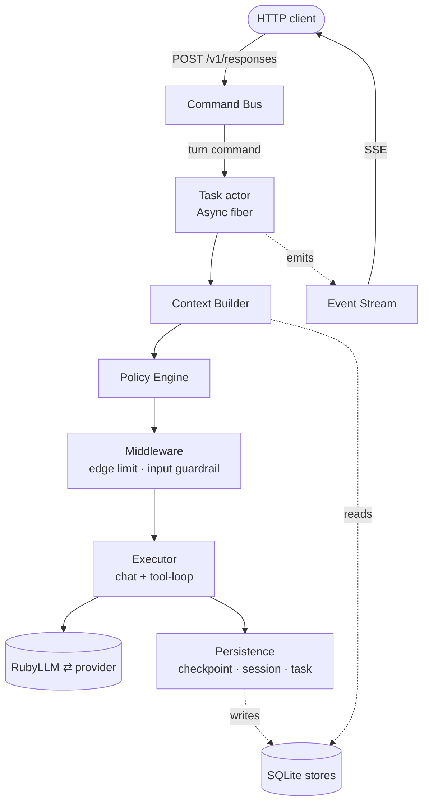
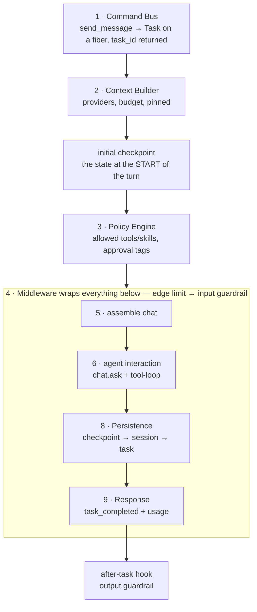
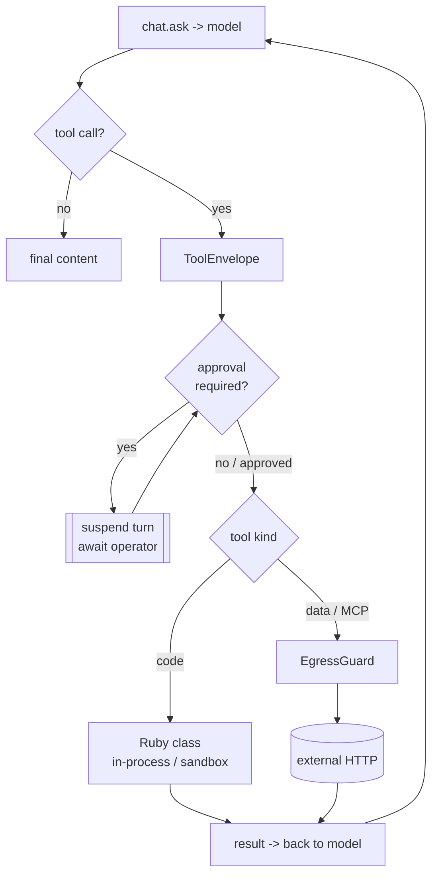
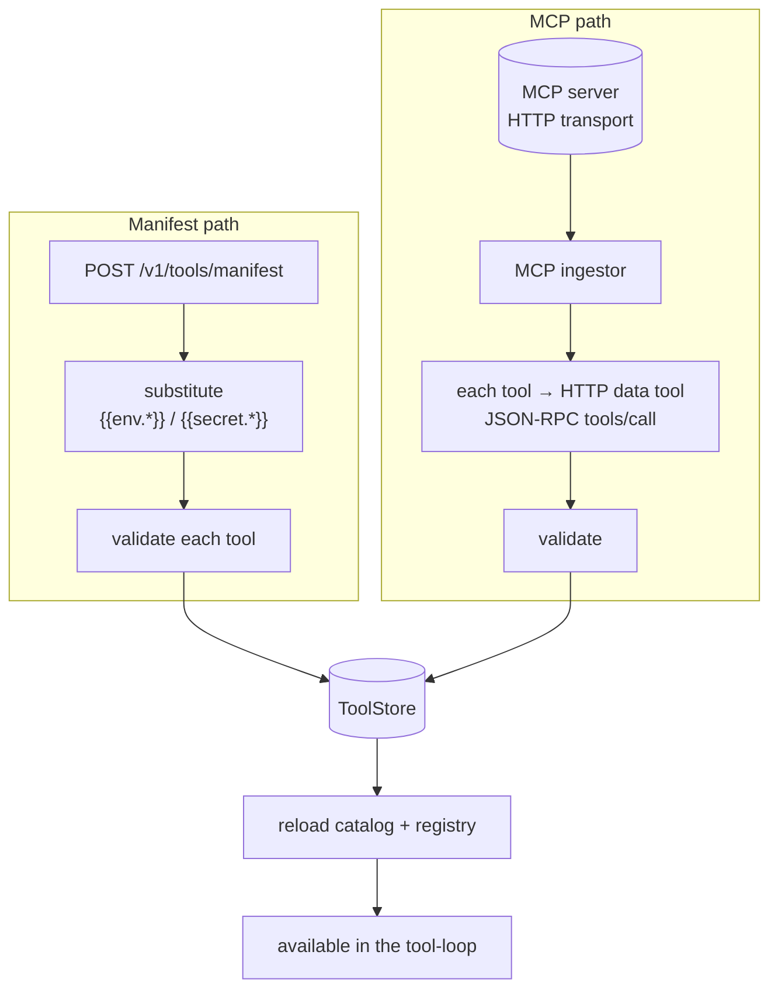
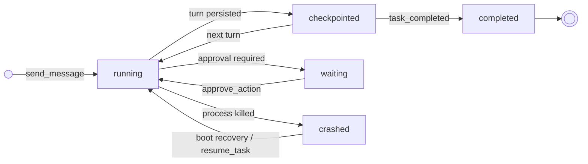
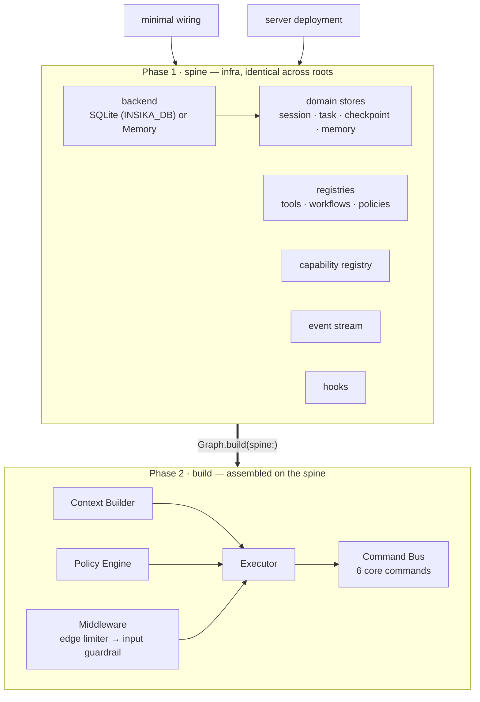

# Architecture

This is the engineering reference — how a turn actually runs, why the pieces are
shaped the way they are, and where to look in the code. It is deliberately
separate from the [capability guides](AGENTS.md); those tell you *how to use* the
runtime, this tells you *how it works*.

Five principles run through everything below:

1. **RubyLLM does the model work.** Chat, streaming, the tool-loop, and provider
   retries are never reimplemented — the engine is the operational shell around
   them.
2. **One pipeline.** Every conversational turn goes through the *same* ordered
   stages. There is no fast path that skips policy or persistence.
3. **Everything is a Command.** Every state-changing interaction is a typed
   command through one bus; reads go straight to the stores, never through the
   runtime.
4. **Durable by default.** Every turn checkpoints; a killed process resumes from
   the last checkpoint on reboot.
5. **Config over code.** Agents, tools, skills, and policies are data in stores,
   editable hot — not classes you redeploy.

## The engine at a glance

A request enters as a Command, becomes a Task running on its own fiber, and streams
its progress out through the Event Stream as it moves down the pipeline.

- **Command Bus** validates and dispatches. A *turn* command (`send_message`,
  `trigger_workflow`) creates a Task and returns its id immediately; the result
  flows out on the Event Stream. A *control* command (`create_session`,
  `cancel_task`, `pause_task`, `approve_action`, `resume_task`) acts on stores
  synchronously. Queries are **not** commands — they read the stores directly.
- **Task actor** is an `Async` fiber with a minimal mailbox (`cancel`,
  `user_message`, pause). Because an LLM turn is almost all *waiting* on the
  provider, one process runs many concurrent turns on a fiber scheduler instead of
  pinning a thread per call.
- **Event Stream** is in-process pub/sub. Every event carries `task_id` and a
  monotonic `seq`, so one stream multiplexes many turns and replays reliably. Not
  every event is for the end user: the provider's reasoning rides it as `:thinking`
  for the Studio and the trace, and the `/v1/responses` edge deliberately drops it —
  deliberation is observability, not the answer.

## A turn, end to end

The Executor runs a fixed sequence of stages. Each stage boundary drains the
mailbox, so a cancel or pause is honored at a safe point — never mid-write.

The numbers are the engine's own — the same stage numbers `executor.rb` uses. The
sequence has no stage 7; the numbering is kept as the code has it rather than
renumbered here.

The order is not arbitrary:

- **Context before policy.** The prompt is assembled first so policy can see what
  the turn will actually contain (candidate skills come from the catalog, tools
  from the registry).
- **The initial checkpoint is written before the model call.** "The checkpoint of
  turn *n* holds the state at the *start* of turn *n*." Without it, a crash during
  the model call would orphan the task with no checkpoint — unrecoverable.
- **Middleware wraps the model-facing stages**, so the edge limiter and input
  guardrail run *before* the provider is ever touched — a flood or an injection is
  refused without a paid model call.
- **Persistence is a fixed order** (checkpoint → session → task) and a pure drain
  point: the last stage never suspends, so a checkpoint is never left half-written.
- **Output validation** runs as an after-task hook on the produced content
  (the output guardrail).

## The tool-loop

Stage 6 is the single agent interaction. RubyLLM owns the reason→act→observe loop;
the engine wraps each tool the model may call in a **ToolEnvelope** that enforces
the per-tool timeout, records side-effects for checkpointing, skips
already-completed side-effects on resume, and fires the approval gate.

A **data tool** is config, not code (see [Tools](TOOLS.md)): its result comes back
to the model exactly like a code tool's, but it went out over HTTP through the
egress guard. A tool exception is caught and returned *to the model* as an error
result — it does not crash the turn. Side-effecting tools (POST and friends) are
recorded in the checkpoint so a resume does not re-run them.

## Ingesting tools: manifest and MCP

Tools become data in the store through two runtime paths, both hot (no restart):

The manifest path is the **only** one that resolves `{{env.*}}` (at ingestion);
every other write path requires a literal URL. Partial failure on the manifest
path is isolated — one malformed tool is reported in `errors[]` while the rest
import. See [Tools](TOOLS.md#registering-a-tool).

## Durability: checkpoints and resume

The runtime has no external job queue. Durability is stores plus **boot recovery**:
at startup the recovery scan finds tasks that were mid-flight and resumes each from
its last valid checkpoint — the *same* code path a `resume_task` command uses.

Resume always replays from the *start of the last checkpointed turn*. Tool calls
that already completed in the interrupted turn are recorded in the checkpoint and
**not** re-executed, so a non-idempotent side-effect fires at most once. A resumed
turn is also never re-counted against edge-limit ledgers. Cancellation is
cooperative — checked at stage boundaries, never in the middle of a store write.

## Composition root

The whole graph is wired in one place — `Insika::Wiring::Graph` — in two phases,
so the two deployment roots (a minimal in-process wiring and the full server
deployment) share the parts that are identical and layer on only what genuinely
differs.

Everything in phase 1 is passed into phase 2: the domain stores, registries,
capability registry, event stream and hooks are all constructor arguments of the
Executor and the Command Bus (`spine.*` throughout `Graph.build`). The arrow is one
call, not one wire.

`backend_from_env` picks the backend: `INSIKA_DB` set → durable SQLite (the
prerequisite for recovery); unset → ephemeral in-memory (dev/demo). Registering the
operator commands (`pause_task`, `approve_action`) in the shared core is what lets
both roots expose the Studio's controls without a per-root patch. The guardrails
factory contributes the input guardrail as the single middleware and the output
validator as the after-task hook, so both roots enforce content safety identically.

## Where the code lives

| Concern | Code |
|---------|------|
| Composition root | `lib/insika/wiring/graph.rb` |
| Command bus + handlers | `lib/insika/command_bus.rb`, `lib/insika/commands/*` |
| Turn pipeline | `lib/insika/executor.rb` |
| Context assembly | `lib/insika/context/*` |
| Policy | `lib/insika/policy/*` |
| Stores | `lib/insika/stores/*`, `lib/insika/*_store.rb` |
| Recovery | `lib/insika/recovery.rb` |
| Tools (data/manifest/MCP) | `lib/insika/tool_definition.rb`, `tool_manifest.rb`, `mcp_tool_ingestor.rb` |
| HTTP/SSE surface | `server/*` |

## See also

- [Agents](AGENTS.md) · [Tools](TOOLS.md) · [Skills](SKILLS.md) ·
  [Context](CONTEXT.md) · [Security](SECURITY.md) — the capability guides.
- [Deploy](DEPLOY.md) — running the engine durably.
- [Benchmark](BENCHMARK.md) — the per-turn engine overhead, reproducible.
